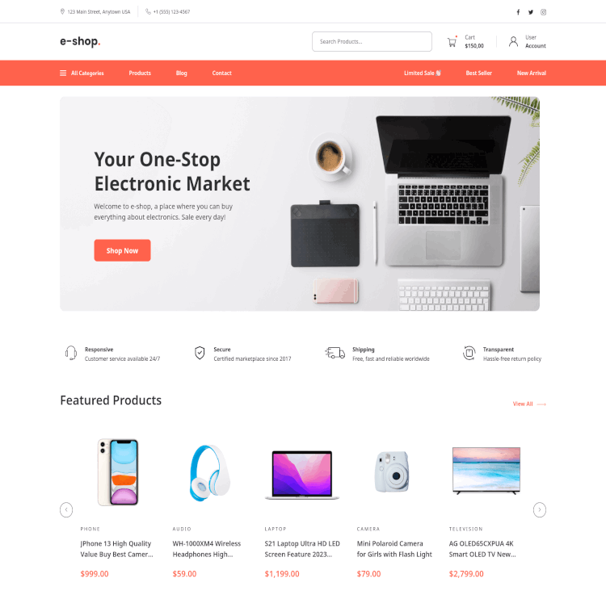

<h1 align="center">e-shop. - The e-commerce platform</h1>

<p align="center">
  <picture>
    <source media="(prefers-color-scheme: dark)" srcset="./docs/assets/logo-light.svg" width="286" height="74">
    
  </picture>
  <br />
  <em>E-shop is a e-commerce platform to sell electronics goods online
  <br /> using TypeScript, MERN/MENN stack and other leading technologies.</em>
  <br />  
</p>

<p align="center">
  
  
  
  <br />
</p>

> [!IMPORTANT]
> The project is at an early stage of development so it currently only contains a UI components library.
> You can view the UI components using Storybook, to do this go to the [Storybook](#storybook) section.

## Table of Contents

- [About The Project](#about-the-project)
  - [Tech stack](#tech-stack)
- [Getting Started](#getting-started)
  - [Prerequisites](#prerequisites)
  - [Installation](#installation)
  - [Run Locally](#run-locally)
  - [Add sample data](#add-sample-data)
  - [Storybook](#storybook)
- [License](#license)

## About The Project

<p align="center">
  
  <br />
</p>

This project is a full-stack e-commerce platform designed to sell electronic goods online. It follows the <abbr title="Minimum Viable Product">MVP</abbr> development strategy, which means that initially, only the most relevant features are implemented to make the platform usable. Additional features will be added gradually in the future. The design is based on a paid [Figma project](https://www.creativefabrica.com/pl/product/e-shop-e-commerce-website-design-ui/) and adheres to a Pixel Perfect approach and incorporates <abbr title="Responsive Web Design">RWD</abbr> to ensure optimal work across all devices. As mentioned earlier, the use of an MVP approach is the primary reason why some elements from the Figma project are not currently included in the project. These elements will be implemented in future updates.

### Tech stack

> [!NOTE]
> Next.js includes its own server implementation that allows interaction with databases and more. However, I have chosen to use Express alongside Next.js because, in my opinion, Express is more scalable and powerful.

This project is developed using the <abbr title="MongoDB, Express.js, Next.js, and Node.js JavaScript software stack">MENN</abbr> stack. A common variant, the <abbr title="MongoDB, Express.js, React.js, and Node.js JavaScript software stack">MERN</abbr> stack, replaces Next.js with vanilla React to enhance SEO optimization and accelerate project development. Key technologies employed in this project include:

- [Next.js](https://nextjs.org/) (a [React.js](https://reactjs.org/) framework)
- [TypeScript](https://www.typescriptlang.org/),
- [Express](https://expressjs.com/)
- [Mongoose](https://mongoosejs.com/) (a ODM for [MongoDB](https://www.mongodb.com/))
- [Node.js](https://nodejs.org/)
- [Nx](https://nx.dev/)

In addition, the project uses technologies like (or will be):

- [Zod](https://zod.dev/) _(planned for future use)_
- [React Hook Form](https://react-hook-form.com/) _(planned for future use)_
- [Styled Components](https://styled-components.com/)
- [Storybook](https://storybook.js.org/)
- [Base UI](https://mui.com/base-ui/) or [React Aria](https://react-spectrum.adobe.com/react-aria/) _(planned for future use)_
- [Stripe](https://stripe.com/) or [Paypal](https://www.paypal.com/) _(planned for future use)_
- [Jest](https://jestjs.io/)
- [React Testing Library](https://testing-library.com/docs/react-testing-library/intro/)
- [Cypress](https://www.cypress.io/)

## Getting Started

### Prerequisites

Before starting work on the project, ensure the following requirements are installed on your computer:

- [Node.js](https://nodejs.org/): Version 18 or higher
- [NPM](https://www.npmjs.com/): Version 18 or higher

You will also need to install [Git](https://github.com/git-guides/install-git) to clone the repository.
Also, you will need [MongoDB Connection Strings](https://www.mongodb.com/resources/products/fundamentals/mongodb-connection-string)

### Installation

Clone the project:

```bash
git clone https://github.com/pawelrusak/fullstack-e-commerce.git
```

Go to the project directory:

```bash
cd fullstack-e-commerce
```

Install dependencies:

```bash
npm ci
```

### Run Locally

After [installation](#installation), create a `./apps/backend/.env` file:

```bash
cp ./apps/backend/.env.example ./apps/backend/.env
```

Open the `./apps/backend/.env` file and add your [MongoDB Connection Strings](https://www.mongodb.com/resources/products/fundamentals/mongodb-connection-string) to the `DATABASE_URI` variable:

```bash
DATABASE_URI="your-mangodb-connection-string"
```

> [!TIP]
> You can add sample data to your app using seeder. Read more about it in the [Add sample data](#add-sample-data) section.

Start the server:

```bash
npm start
```

### Add sample data

To populate your application with sample data, use the provided seeder tool.

After [installation](#installation), create a `./tools/seed/.env` file:

```bash
cp ./tools/seed/.env.example ./tools/seed/.env
```

Open the `./tools/seed/.env` file and add your [MongoDB Connection Strings](https://www.mongodb.com/resources/products/fundamentals/mongodb-connection-string) to the `DATABASE_URI` variable:

```bash
DATABASE_URI="your-mangodb-connection-string"
```

Add sample data to your database:

```bash
npm run seed
```

### Storybook

After [installation](#installation), start the component explorer:

```bash
npx nx storybook ui
```

## License

Distributed under the MIT License. See [LICENSE](./LICENSE) for more information.
