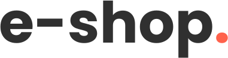

<h1 align="center">e-shop. - The e-commerce platform</h1>

  <picture>
    <source media="(prefers-color-scheme: dark)" srcset="./docs/assets/logo-light.svg" width="286" height="74">
    
  </picture>
   
   
  <em>E-shop is a e-commerce platform to sell electronics goods online
    using TypeScript, MERN/MENN stack and other leading technologies.</em>
     

## About The Project

This project is a full-stack e-commerce platform designed to sell electronic goods online. It follows the <abbr title="Minimum Viable Product">MVP</abbr> development strategy, which means that initially, only the most relevant features are implemented to make the platform usable. Additional features will be added gradually in the future. The design is based on a paid [Figma project](https://www.creativefabrica.com/pl/product/e-shop-e-commerce-website-design-ui/) and adheres to a Pixel Perfect approach and incorporates <abbr title="Responsive Web Design">RWD</abbr> to ensure optimal work across all devices. As mentioned earlier, the use of an MVP approach is the primary reason why some elements from the Figma project are not currently included in the project. These elements will be implemented in future updates.

### Built With

This project is developed using the <abbr title="MongoDB, Express.js, Next.js, and Node.js JavaScript software stack">MENN</abbr> stack. A common variant, the <abbr title="MongoDB, Express.js, React.js, and Node.js JavaScript software stack">MERN</abbr> stack, replaces Next.js with vanilla React to enhance SEO optimization and accelerate project development. Key technologies employed in this project include:

- [Next.js](https://nextjs.org/) (a [React.js](https://reactjs.org/) framework )
- [TypeScript](https://www.typescriptlang.org/),
- [Express](https://expressjs.com/) _(planned for future use)_
- [Mongoose](https://mongoosejs.com/) (a ODM for [MongoDB](https://www.mongodb.com/)) _(planned for future use)_
- [Node.js](https://nodejs.org/)
- [Nx](https://nx.dev/)

In addition, the project uses technologies like (or will be):

- [Zod](https://zod.dev/) _(planned for future use)_
- [React Hook Form](https://react-hook-form.com/) _(planned for future use)_
- [Styled Components](https://styled-components.com/)
- [Storybook](https://storybook.js.org/)
- [Jest](https://jestjs.io/)
- [React Testing Library](https://testing-library.com/docs/react-testing-library/intro/)
- [Cypress](https://www.cypress.io/)

## License

Distributed under the MIT License. See [LICENSE](./LICENSE) for more information.
